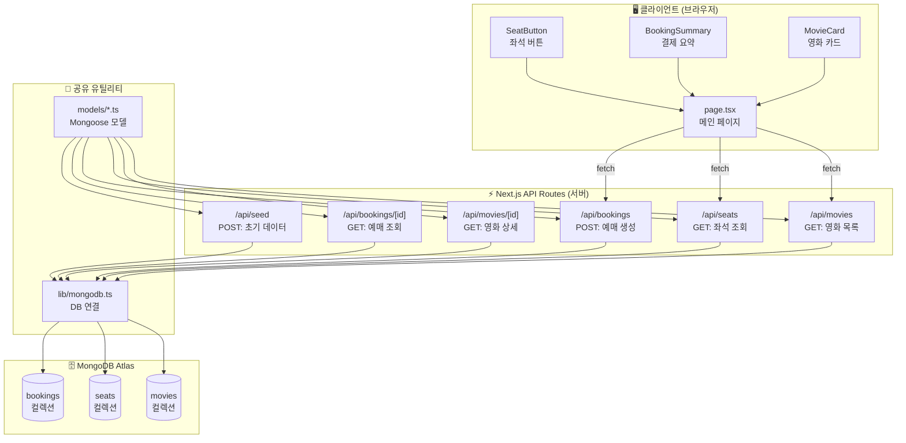
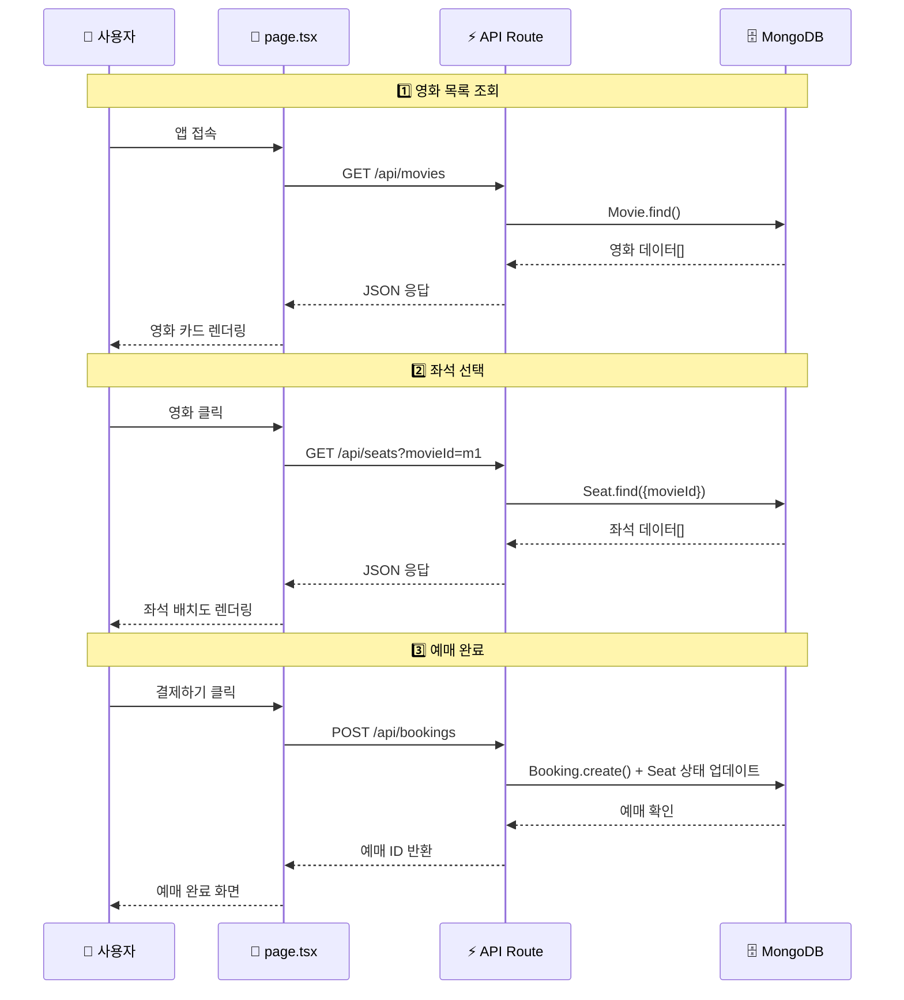
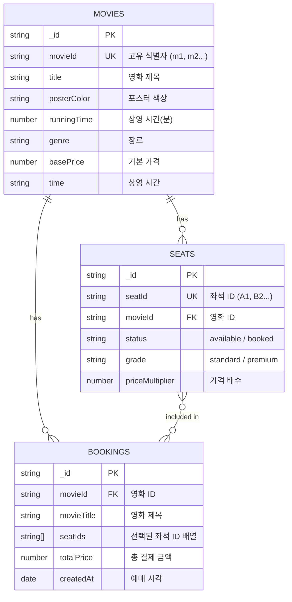
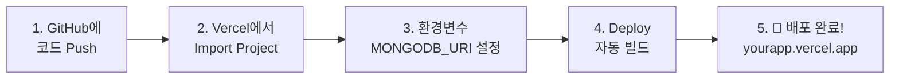
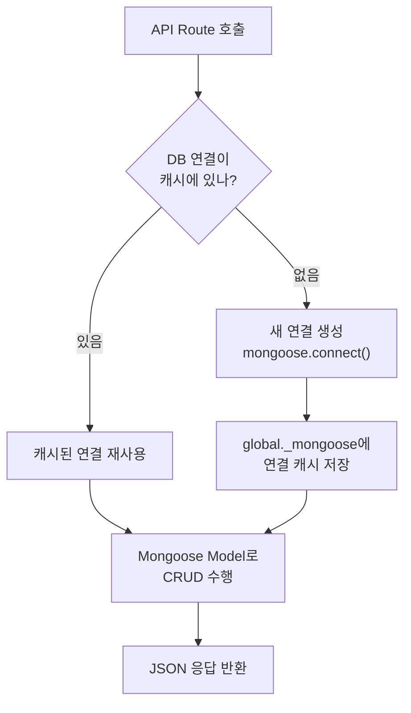
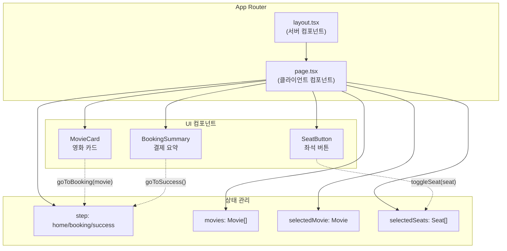

# 🎬 Cinema Next - 전체 아키텍처 문서

## 📌 프로젝트 개요

| 항목 | 내용 |
|------|------|
| **앱 이름** | Cinema Next (영화 예매 시스템) |
| **프레임워크** | Next.js 16 (App Router) |
| **데이터베이스** | MongoDB Atlas (클라우드) |
| **ODM** | Mongoose |
| **호스팅** | Vercel |
| **스타일링** | Tailwind CSS v4 |

---

## 🏗️ 전체 시스템 아키텍처



---

## 📁 프로젝트 폴더 구조

```
ticket/
├── app/                          # Next.js App Router
│   ├── layout.tsx                # 루트 레이아웃 (HTML 뼈대)
│   ├── page.tsx                  # 메인 페이지 (클라이언트)
│   ├── globals.css               # 전역 스타일
│   └── api/                      # ⭐ 백엔드 API 라우트
│       ├── movies/
│       │   └── route.ts          # GET /api/movies
│       ├── seats/
│       │   └── route.ts          # GET /api/seats?movieId=xxx
│       ├── bookings/
│       │   ├── route.ts          # POST /api/bookings
│       │   └── [id]/
│       │       └── route.ts      # GET /api/bookings/:id
│       └── seed/
│           └── route.ts          # POST /api/seed (초기 데이터)
│
├── src/
│   ├── components/               # UI 컴포넌트들
│   │   ├── SeatButton.tsx        # 좌석 버튼
│   │   ├── BookingSummary.tsx    # 결제 요약
│   │   ├── MovieCard.tsx         # 영화 카드
│   │   └── Header.tsx            # 헤더
│   ├── lib/                      # ⭐ 유틸리티
│   │   └── mongodb.ts            # MongoDB 연결 관리
│   ├── models/                   # ⭐ Mongoose 모델 (스키마)
│   │   ├── Movie.ts              # 영화 모델
│   │   ├── Seat.ts               # 좌석 모델
│   │   └── Booking.ts            # 예매 모델
│   └── types/
│       └── index.ts              # TypeScript 타입 정의
│
├── .env.local                    # 🔑 환경변수 (MongoDB URI)
├── package.json
├── next.config.ts
└── tsconfig.json
```

---

## 🔄 데이터 흐름 (예매 과정)



---

## 📊 데이터베이스 모델 (MongoDB 컬렉션)



---

## 🌐 API 엔드포인트 목록

| 메서드 | 경로 | 설명 | 요청 바디 | 응답 |
|--------|------|------|----------|------|
| `GET` | `/api/movies` | 영화 목록 조회 | - | `Movie[]` |
| `GET` | `/api/seats?movieId=xxx` | 특정 영화의 좌석 조회 | - | `Seat[]` |
| `POST` | `/api/bookings` | 예매 생성 | `{movieId, seatIds, totalPrice}` | `Booking` |
| `GET` | `/api/bookings/[id]` | 예매 상세 조회 | - | `Booking` |
| `POST` | `/api/seed` | 초기 데이터 생성 | - | `{message}` |

---

## 🔑 환경변수 설정

```env
# .env.local
MONGODB_URI=mongodb+srv://<사용자명>:<비밀번호>@<클러스터>.mongodb.net/<DB이름>?retryWrites=true&w=majority
```

> [!IMPORTANT]
> MongoDB Atlas에서 무료 클러스터를 생성한 후, Connection String을 `.env.local`에 넣어야 합니다.

---

## 🚀 Vercel 배포 절차



### 상세 단계:

1. **GitHub 리포지토리 연결**
   - `git push origin main` 으로 코드를 GitHub에 업로드

2. **Vercel 프로젝트 설정**
   - [vercel.com](https://vercel.com) 에서 "Import Project" 클릭
   - GitHub 리포지토리 선택
   - Root Directory: `ticket` (모노레포 구조이므로)

3. **환경변수 등록**
   - Vercel 대시보드 → Settings → Environment Variables
   - `MONGODB_URI` 값 입력

4. **자동 배포**
   - `main` 브랜치에 push할 때마다 자동으로 재배포

---

## 🔧 MongoDB 연결 구조 (핵심)



> [!NOTE]
> Vercel의 서버리스 환경에서는 매 요청마다 새 연결을 만들면 비효율적이므로, `global` 객체에 연결을 캐싱하는 패턴을 사용합니다. 이것이 `lib/mongodb.ts`의 핵심 역할입니다.

---

## 🧩 컴포넌트 관계도



---

## ✅ 변경 사항 요약 (Before → After)

| 항목 | Before (기존) | After (변경 후) |
|------|--------------|----------------|
| 데이터 소스 | `mockMovies` 하드코딩 | MongoDB에서 `fetch()` |
| 좌석 데이터 | `MOCK_SEATS` 하드코딩 | MongoDB에서 영화별 조회 |
| 예매 처리 | 화면 전환만 | DB에 예매 기록 저장 + 좌석 상태 변경 |
| API | 없음 | 5개 API Route 추가 |
| DB 연결 | 없음 | `lib/mongodb.ts` 연결 관리 |
| 환경변수 | 비어있음 | `MONGODB_URI` 설정 |
| 배포 | 로컬만 | Vercel 배포 가능 |
