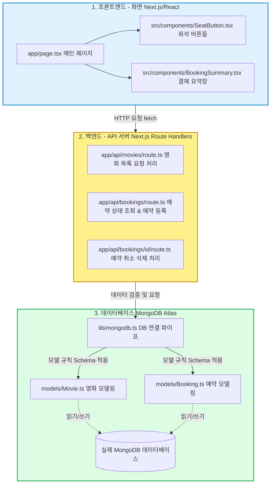
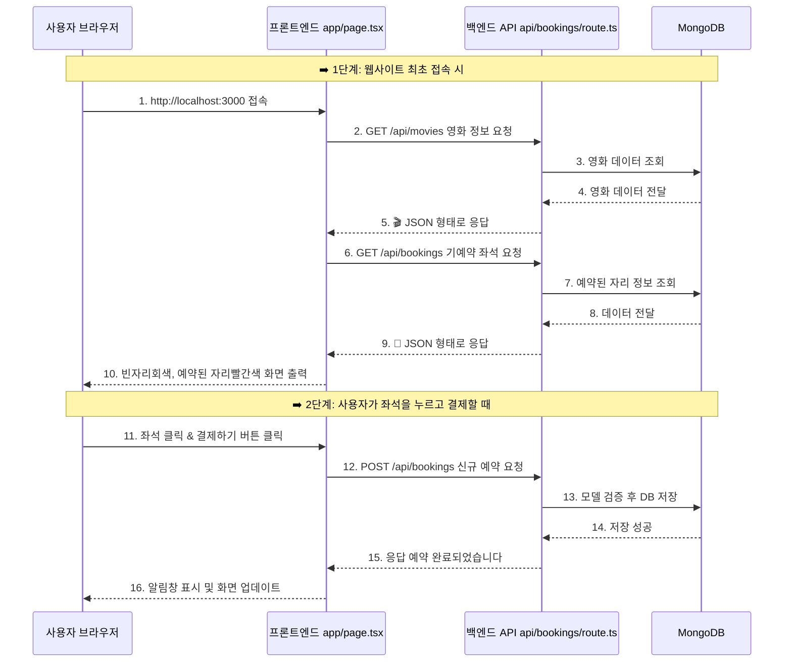

# 🎫 티켓팅 시스템 전체 구조 및 실행 흐름도

이 문서는 사용자가 브라우저에서 버튼을 클릭했을 때 데이터베이스까지 어떻게 정보가 흘러가는지를 보여주는 도식화입니다. 머릿속으로 아래의 흐름을 그리면서 코드를 작성하면 훨씬 이해가 쉽습니다.

## 1. 전체 아키텍처 (어플리케이션 구조)

---

## 2. 좌석 예매 실행 흐름 (데이터가 오가는 과정)

사용자가 사이트에 접속해서 자리를 예매하는 과정의 실제 흐름입니다.

### 💡 흐름 이해하기 팁!
* **프론트엔드 (파란 구역)**: 식당의 "메뉴판"과 "손님 눈앞에 보이는 접시"라고 생각하세요. 오직 **UI와 클릭 이벤트**만 담당합니다. 데이터가 필요하면 백엔드에게 "fetch(요청)"를 보냅니다.
* **백엔드 API (노란 구역)**: 식당의 "메인 셰프"입니다. 프론트엔드의 요청을 받아서, 유효한 요청인지 검사하고, 데이터를 데이터베이스에 저장하거나 불러옵니다.
* **데이터베이스 (초록 구역)**: 식당의 "대형 냉장고"입니다. 데이터들이 차곡차곡 쌓여있는 곳입니다. 

방문자가 어떤 행동을 하면 `UI(클릭) -> 프론트(fetch) -> 백엔드(검증) -> DB(저장/조회)` 순서로 흘러갑니다. 
이 흐름을 머릿속에 담아두고 코드를 짜면 길을 잃지 않습니다.
